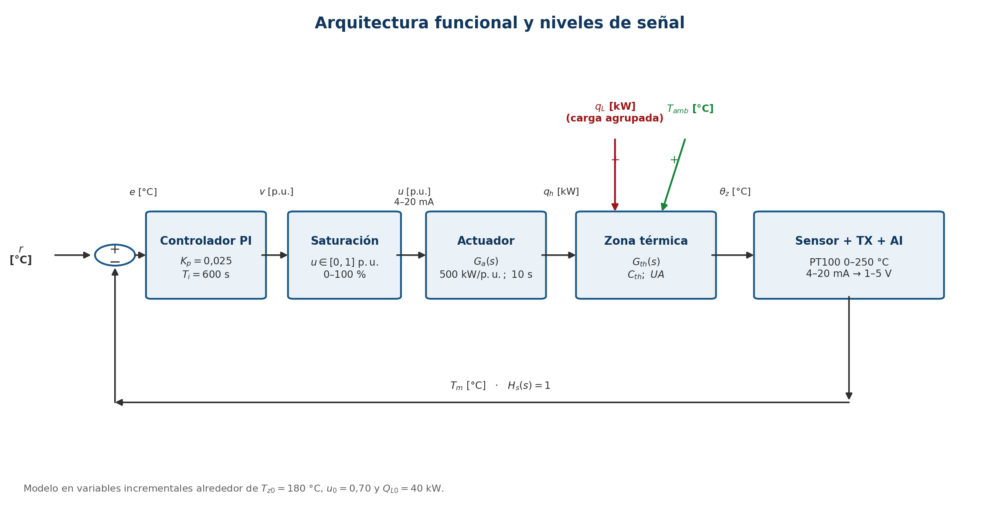

**UNIVERSIDAD NACIONAL DE CÓRDOBA**

**FACULTAD DE CIENCIAS EXACTAS, FÍSICAS Y NATURALES**

Carrera: Ingeniería Electrónica

Cátedra: Sistemas de Control I

Docentes: Ing. Adrián Claudio Agüero e Ing. Juan Pablo Pedroni

```{=openxml}
<w:p><w:r><w:br w:type="page"/></w:r></w:p>
```

# Índice {-}

- Resumen ........................................................................ 3
- 1. Introducción ................................................................ 3
- 2. Definición del problema ...................................................... 4
- 3. Modelado matemático .......................................................... 6
- 4. Análisis de la planta ........................................................ 8
- 5. Especificaciones de diseño .................................................. 11
- 6. Diseño del controlador ...................................................... 12
- 7. Simulación del sistema controlado ........................................... 14
- 8. Discusión y limitaciones .................................................... 17
- 9. Conclusiones ................................................................ 17
- Bibliografía ................................................................... 18
- Apéndice: reproducibilidad ...................................................... 18

```{=openxml}
<w:p><w:r><w:br w:type="page"/></w:r></w:p>
```

# Resumen {-}

Este trabajo desarrolla el modelo, el análisis y el control de temperatura de
una zona equivalente de un horno de curado de cataforesis automotriz. El horno
se representa como un sistema térmico concentrado con pérdidas hacia el
ambiente, una carga térmica agrupada y un actuador de primer orden que modela
la modulación del quemador. El punto nominal adoptado es de 180 °C, con una
orden de quemador de 0,70 p.u.

El camino orden-temperatura resulta una planta estable, de segundo orden,
sobreamortiguada y de tipo 0:

$$
G_p(s)=\frac{250}{(10s+1)(600s+1)}.
$$

La dinámica térmica dominante produce una respuesta abierta lenta y error
estacionario ante perturbaciones sostenidas. Para mejorar el seguimiento y el
rechazo de carga se diseña un controlador PI con $K_p=0{,}025$ y
$T_i=600$ s. El cero del PI cancela nominalmente el polo térmico estable del
modelo, mientras que la ganancia proporcional se elige respetando el margen
disponible del actuador.

Las simulaciones en GNU Octave verifican, para un escalón de referencia de
+10 °C, error estacionario nulo, sobrepasamiento de 0 %, tiempo de
establecimiento de 265,8 s y orden máxima de 0,950352 p.u. Ante un incremento
de carga de +50 kW, la desviación mínima es de -2,89869 °C y el retorno
permanente a la banda de ±2 °C ocurre a los 504,9 s. Ninguno de los dos ensayos
activa la saturación. Los resultados corresponden a un modelo académico
nominal y no constituyen una validación experimental ni una demostración de
robustez industrial.

# Introducción

La cataforesis es un proceso de recubrimiento utilizado en la industria
automotriz para proteger las carrocerías frente a la corrosión. Luego de la
deposición electroforética, la pintura requiere una etapa de curado térmico. La
calidad del curado depende de la historia térmica de la pieza y de su tiempo de
permanencia dentro del horno. Por este motivo, la regulación de temperatura es
una función relevante del proceso.

Un horno real tiene varias zonas, circulación de aire, combustión, transporte
de carrocerías y distribuciones espaciales de temperatura. Modelar cada uno de
esos fenómenos excede el alcance de Sistemas de Control I. En este trabajo se
adopta una zona térmica equivalente, de parámetros concentrados, cuya salida es
la temperatura del aire. La energía absorbida por carrocerías, carriers y
renovación de aire se agrupa como una perturbación de carga.

El objetivo es integrar las etapas clásicas de un problema de control:

- definir el sistema, sus variables, perturbaciones y no linealidades;
- obtener un modelo matemático y sus funciones de transferencia;
- analizar estabilidad, tipo y respuesta temporal;
- formular especificaciones realizables;
- diseñar un controlador con técnicas vistas en la materia;
- simular lazo abierto y lazo cerrado, incluida la saturación del actuador;
- comparar los resultados y reconocer las limitaciones del modelo.

Todos los parámetros numéricos adoptados fueron definidos como supuestos
académicos con el objetivo de desarrollar este trabajo. No se utilizaron datos
confidenciales ni mediciones de un horno industrial.

# Definición del problema

## Variable controlada y acción de control

La variable controlada es la temperatura del aire de la zona, $T_z(t)$, medida
en grados Celsius. La referencia $T_r(t)$ se compara con la temperatura medida
y el controlador genera una orden normalizada al sistema de modulación del
quemador. Se define

$$
0\le u(t)\le 1,
$$

donde 0 representa 0 % y 1 representa 100 % de la potencia térmica efectiva
disponible en el modelo.

El actuador agrupa la interfaz de mando, la válvula modulante y la dinámica
efectiva del quemador. Su salida es la potencia térmica $Q_h(t)$. La principal
perturbación analizada es $Q_L(t)$, una potencia absorbida por la carga y la
renovación de aire. La temperatura ambiente $T_{amb}(t)$ constituye una segunda
entrada perturbadora.

## Variables y unidades

| Símbolo | Descripción | Unidad |
|---|---|---:|
| $T_z(t)$ | Temperatura del aire de la zona | °C |
| $T_{amb}(t)$ | Temperatura ambiente | °C |
| $T_r(t)$ | Referencia de temperatura | °C |
| $u(t)$ | Orden total al quemador | p.u. |
| $Q_h(t)$ | Potencia térmica efectiva entregada | W |
| $Q_L(t)$ | Carga térmica agrupada | W |
| $C_{th}$ | Capacitancia térmica equivalente | J/K |
| $R_{th}$ | Resistencia térmica equivalente | K/W |
| $UA$ | Conductancia térmica equivalente | W/K |
| $K_a$ | Ganancia estática del actuador | W/p.u. |
| $\tau_a$ | Constante de tiempo del actuador | s |

## Medición y niveles de señal

Se adopta una PT100 con transmisor de temperatura. Para cerrar los niveles de
señal solicitados por la guía se fija, como supuesto académico de
instrumentación, un rango de 0 a 250 °C mapeado linealmente a 4-20 mA. Una
resistencia de precisión de 250 $\Omega$ convierte esa corriente en 1-5 V para
una entrada analógica de 0-10 V. En el controlador, la señal se reconvierte a
grados Celsius. Como la dinámica de sensor, transmisor y adquisición es mucho
más rápida que la constante térmica de 600 s, se aproxima en unidades de
ingeniería por

$$
H_s(s)=1.
$$

El mando físico al modulador se supone de 4-20 mA, proporcional a
$u\in[0,1]$. Esta selección de instrumentación permite especificar la cadena de
señales, pero no modifica las funciones de transferencia del modelo térmico.

| Señal | Rango de ingeniería | Nivel físico adoptado |
|---|---:|---:|
| Referencia $T_r$ | 0-250 °C | valor digital en °C |
| Temperatura medida $T_m$ | 0-250 °C | PT100 + 4-20 mA |
| Entrada analógica | 0-250 °C | 1-5 V sobre 250 $\Omega$ |
| Orden $u$ | 0-1 p.u. | 4-20 mA al modulador |
| Potencia $Q_h$ | 0-500 kW | variable térmica del modelo |

{width=6.45in}

## Perturbaciones y no linealidades

Las perturbaciones consideradas son:

- variaciones de carga térmica por ingreso de carrocerías, carriers y aire de
  renovación;
- cambios de temperatura ambiente;
- variaciones no modeladas de pérdidas y capacidad térmica.

La no linealidad incorporada en la simulación es la saturación de la orden
entre 0 y 100 %. También pueden existir potencia mínima estable del quemador,
retardos de transporte y mezcla, pérdidas radiativas no lineales, cambios de
$UA$ y $C_{th}$ con la carga y lógicas discretas de seguridad. Estas últimas se
documentan como limitaciones y no se incorporan al modelo nominal.

# Modelado matemático

## Modelo del actuador

La dinámica equivalente de válvula y quemador se representa mediante un primer
orden:

$$
\tau_a\frac{dQ_h(t)}{dt}+Q_h(t)=K_a u(t).
$$

Al trabajar con desviaciones respecto del equilibrio, $q_h=Q_h-Q_{h0}$ y
$v=u-u_0$, se obtiene

$$
G_a(s)=\frac{Q_h(s)}{V(s)}=\frac{K_a}{\tau_a s+1},
$$

donde $Q_h(s)$ representa la transformada de la señal incremental $q_h(t)$.

## Balance energético de la zona

La conservación de energía en el volumen térmico equivalente se escribe como

$$
C_{th}\frac{dT_z(t)}{dt}
=Q_h(t)-UA\left[T_z(t)-T_{amb}(t)\right]-Q_L(t).
$$

Los cuatro términos corresponden, respectivamente, a acumulación de energía,
potencia del quemador, pérdidas equivalentes al ambiente y potencia absorbida
por la carga. Se conserva explícitamente $T_{amb}$ porque el punto nominal se
formula con temperaturas físicas.

## Punto de operación

En régimen permanente,

$$
0=Q_{h0}-UA(T_{z0}-T_{amb0})-Q_{L0},
$$

por lo que

$$
Q_{h0}=UA(T_{z0}-T_{amb0})+Q_{L0},
\qquad
u_0=\frac{Q_{h0}}{K_a}.
$$

Los parámetros adoptados son los siguientes.

| Parámetro | Valor |
|---|---:|
| $T_{z0}$ | 180 °C |
| $T_{amb0}$ | 25 °C |
| $Q_{L0}$ | 40 kW |
| $UA$ | 2000 W/K |
| $C_{th}$ | 1,2 MJ/K |
| $K_a$ | 500 kW/p.u. |
| $\tau_a$ | 10 s |

Entonces,

$$
R_{th}=\frac{1}{UA}=5\times10^{-4}\;\mathrm{K/W},
\qquad
\tau_T=R_{th}C_{th}=600\;\mathrm{s},
$$

$$
Q_{h0}=350\;\mathrm{kW},
\qquad
u_0=0{,}70.
$$

El equilibrio deja una reserva ascendente de 0,30 p.u., equivalente a 150 kW.

## Modelo incremental

Se definen las desviaciones

$$
\theta=T_z-T_{z0},\qquad
\theta_{amb}=T_{amb}-T_{amb0},
$$

$$
q_h=Q_h-Q_{h0},\qquad
q_L=Q_L-Q_{L0},\qquad
v=u-u_0.
$$

Al restar la ecuación de equilibrio, el modelo incremental queda

$$
C_{th}\dot\theta=q_h-UA\theta+UA\theta_{amb}-q_L,
$$

$$
\tau_a\dot q_h+q_h=K_a v.
$$

El modelo es lineal mientras $u=u_0+v$ no alcance sus límites y los parámetros
equivalentes permanezcan aproximadamente constantes.

## Funciones de transferencia

Con condiciones iniciales nulas, las funciones de transferencia relacionan
desviaciones alrededor del equilibrio:

$$
G_{th}(s)=\frac{\Theta(s)}{Q_h(s)}
=\frac{1}{C_{th}s+UA}
=\frac{R_{th}}{\tau_Ts+1},
$$

$$
G_p(s)=\frac{\Theta(s)}{V(s)}
=\frac{K_aR_{th}}{(\tau_as+1)(\tau_Ts+1)}
=\frac{250}{(10s+1)(600s+1)},
$$

$$
G_L(s)=\frac{\Theta(s)}{Q_L(s)}
=-\frac{R_{th}}{\tau_Ts+1}
=-\frac{5\times10^{-4}}{600s+1},
$$

$$
G_{amb}(s)=\frac{\Theta(s)}{\Theta_{amb}(s)}
=\frac{1}{600s+1}.
$$

# Análisis de la planta

## Polos, ceros, estabilidad y tipo

Los polos de $G_p(s)$ son

$$
p_1=-\frac{1}{\tau_a}=-0{,}1\;\mathrm{s^{-1}},
\qquad
p_2=-\frac{1}{\tau_T}=-1{,}6667\times10^{-3}\;\mathrm{s^{-1}}.
$$

Ambos se encuentran en el semiplano izquierdo; por lo tanto, la planta es
absolutamente estable. No tiene ceros ni polos en el origen y es de tipo 0. El
polo térmico es dominante, con una separación de 60 respecto del polo del
actuador.

{width=5.9in}

En forma canónica de segundo orden,

$$
\omega_n=0{,}0129099\;\mathrm{rad/s},
\qquad
\zeta=3{,}93753.
$$

Como $\zeta>1$, la planta es sobreamortiguada. La ganancia estática es
$G_p(0)=250$ °C/p.u.

## Respuesta temporal en lazo abierto

Se aplica un escalón físico $\Delta v=0{,}04$ p.u., que cambia la orden total de
0,70 a 0,74. Analíticamente,

$$
\Delta T(\infty)=G_p(0)\Delta v=10\;^\circ\mathrm C,
$$

$$
\Delta Q_h(\infty)=K_a\Delta v=20\;\mathrm{kW}.
$$

La simulación entrega 0 % de sobrepasamiento, tiempo de crecimiento 10-90 % de
1318,34 s y tiempo de establecimiento en banda de ±5 % de 1807,60 s.

{width=6.15in}

La perturbación sostenida $\Delta q_L=+50$ kW produce, en lazo abierto,

$$
\theta(\infty)=G_L(0)\Delta q_L=-25\;^\circ\mathrm C.
$$

{width=6.15in}

Para evaluar la dominancia del polo térmico se compara la planta completa con

$$
G_{red}(s)=\frac{250}{600s+1}.
$$

La superposición de las curvas confirma que el actuador de 10 s aporta una
diferencia pequeña frente a la dinámica térmica de 600 s, aunque se conserva
en el diseño para representar la acción de control con un modelo de segundo
orden.

{width=6.15in}

# Especificaciones de diseño

Se definen dos ensayos incrementales alrededor del punto nominal. Las
convenciones temporales son: tiempo de crecimiento entre 10 % y 90 % de la
amplitud, y tiempo de establecimiento como el primer instante a partir del cual
la respuesta permanece dentro de la banda indicada.

| Ensayo | Especificación | Criterio |
|---|---|---:|
| Referencia $\Delta r=+10$ °C | Error estacionario | 0 °C |
| Referencia $\Delta r=+10$ °C | Sobrepasamiento | $\le 5$ % |
| Referencia $\Delta r=+10$ °C | Establecimiento ±5 % | $\le 600$ s |
| Referencia $\Delta r=+10$ °C | Orden total | $0\le u\le1$ |
| Carga $\Delta q_L=+50$ kW | Desviación máxima | $\le 5$ °C |
| Carga $\Delta q_L=+50$ kW | Retorno permanente a ±2 °C | $\le 600$ s |
| Carga $\Delta q_L=+50$ kW | Orden total | $0\le u\le1$ |

La factibilidad inicial se apoya en la reserva del actuador. Una carga
adicional de 50 kW exige 0,10 p.u. en régimen permanente, menor que la reserva
ascendente de 0,30 p.u. Para el cambio de referencia, la restricción transitoria
se incorpora explícitamente en la elección de $K_p$.

# Diseño del controlador

## Estructura PI y cancelación nominal

Se adopta

$$
C(s)=K_p+\frac{K_i}{s}
=K_p\frac{T_is+1}{T_is}.
$$

El tiempo integral se fija en

$$
T_i=\tau_T=600\;\mathrm{s},
$$

de manera que el cero del PI quede en $-1/600$ s$^{-1}$ y cancele nominalmente
el polo térmico estable de $G_p$. Esta cancelación sólo vale para el modelo
nominal: no elimina físicamente la dinámica térmica y no demuestra robustez
ante incertidumbre paramétrica.

## Selección de la ganancia proporcional

Ante $\Delta r=10$ °C, la acción proporcional instantánea es

$$
v(0^+)=K_p\Delta r,
\qquad
u(0^+)=u_0+K_p\Delta r.
$$

Para evitar saturación superior en el instante inicial debe cumplirse

$$
K_p\le\frac{1-u_0}{\Delta r}=0{,}03\;\mathrm{p.u./^\circ C}.
$$

Se elige $K_p=0{,}025$ dentro de ese límite. Entonces $u(0^+)=0{,}95$ y queda
un margen de 0,05 p.u. respecto del límite superior. La ganancia integral es

$$
K_i=\frac{K_p}{T_i}
=4{,}1666667\times10^{-5}\;\mathrm{p.u./(^\circ C\,s)}.
$$

## Lazo nominal reducido y lugar de raíces

Luego de la cancelación nominal,

$$
L(s)=C(s)G_p(s)=\frac{250K_p}{600s(10s+1)}.
$$

El integrador hace que el lazo sea de tipo 1. La ecuación característica de la
realización mínima es

$$
6000s^2+600s+250K_p=0.
$$

Con $K_p=0{,}025$,

$$
\omega_n=0{,}03227486\;\mathrm{rad/s},
\qquad
\zeta=1{,}549193,
$$

y los polos son

$$
s_1=-0{,}08818813\;\mathrm{s^{-1}},
\qquad
s_2=-0{,}01181187\;\mathrm{s^{-1}}.
$$

El lugar de raíces se construye con

$$
L_0(s)=\frac{250}{600s(10s+1)}.
$$

Tiene polos en 0 y -0,1 s$^{-1}$ y punto de dispersión en -0,05 s$^{-1}$,
correspondiente a $K_p=0{,}06$. La ubicación de los polos y la condición de
módulo en $s=-0{,}01181187$ verifican a posteriori el valor elegido; no son una
segunda derivación independiente de $K_p$.

{width=6.15in}

## Modos internos y estabilidad relativa

La transferencia mínima referencia-temperatura tiene los dos polos anteriores.
Sin embargo, el modelo aumentado con estados del integrador, actuador y zona
térmica conserva además el modo estable

$$
-\frac{1}{600}=-0{,}00166667\;\mathrm{s^{-1}}.
$$

Ese modo se cancela solamente en el canal nominal referencia-temperatura y
permanece en la transferencia de perturbación. La distinción evita interpretar
una cancelación algebraica como eliminación física de un estado.

El análisis frecuencial nominal de $L(s)$ entrega:

- frecuencia de cruce de ganancia: 0,0103612 rad/s;
- margen de fase: 84,0846°;
- margen de ganancia: infinito, al no existir cruce finito de -180°.

{width=6.15in}

# Simulación del sistema controlado

## Modelo lineal y modelo con saturación

Además de las funciones de transferencia se integra por Runge-Kutta de cuarto
orden el modelo de estados con saturación:

$$
e=\Delta r-\theta,
\qquad
v^*=K_pe+K_i\xi,
$$

$$
u=\operatorname{sat}(u_0+v^*,0,1),
\qquad
v=u-u_0,
$$

$$
\dot\xi=e,
\qquad
\tau_a\dot q_h+q_h=K_av,
$$

$$
C_{th}\dot\theta=q_h-UA\theta-q_L.
$$

No se implementa anti-windup. En los ensayos obligatorios la saturación no se
activa, por lo que las trayectorias lineal y saturada coinciden dentro de la
tolerancia numérica definida.

## Seguimiento de referencia

Para $\Delta r=+10$ °C, el PI logra error estacionario analítico nulo. La
respuesta es sobreamortiguada y no presenta sobrepasamiento. La orden máxima es
0,950352 p.u., menor que el límite superior.

Como comparación, con un controlador P de la misma ganancia
$K_p=0{,}025$ el error estacionario es

$$
e_\infty=\frac{10}{1+K_pG_p(0)}=1{,}37931\;^\circ\mathrm C.
$$

La acción integral es la responsable de eliminar ese residuo.

{width=6.1in}

## Rechazo de perturbación

Ante $\Delta q_L=+50$ kW, la temperatura alcanza un mínimo de -2,89869 °C a
los 194,6 s y retorna de forma permanente a la banda de ±2 °C a los 504,9 s.
La orden estacionaria aumenta de 0,70 a 0,80 p.u., exactamente lo esperado para
compensar 50 kW con un actuador de 500 kW/p.u.

Con P puro, en cambio, la desviación estacionaria sería

$$
\theta_\infty=-3{,}44828\;^\circ\mathrm C.
$$

El PI restablece la temperatura nominal en régimen permanente.

{width=6.1in}

## Verificación de especificaciones

| Magnitud | Especificación | Resultado | Cumple |
|---|---:|---:|:---:|
| Error estacionario, referencia | 0 °C | $\approx0$ °C | Sí |
| Sobrepasamiento, referencia | $\le5$ % | 0 % | Sí |
| Establecimiento ±5 %, referencia | $\le600$ s | 265,8 s | Sí |
| Orden máxima, referencia | $\le1$ p.u. | 0,950352 p.u. | Sí |
| Desviación máxima, carga | $\le5$ °C | 2,89869 °C | Sí |
| Retorno permanente a ±2 °C | $\le600$ s | 504,9 s | Sí |
| Orden final, carga | $\le1$ p.u. | 0,80 p.u. | Sí |
| Saturación en ensayos | No sostenida | Inactiva | Sí |

# Discusión y limitaciones

El controlador mejora de forma clara el comportamiento nominal. La planta
abierta tarda 1807,6 s en establecerse ante un pequeño cambio de orden y una
carga de 50 kW genera una desviación permanente de -25 °C. Con PI, el ensayo de
referencia se establece en 265,8 s y la misma carga produce un mínimo de sólo
-2,89869 °C, seguido de recuperación estacionaria.

La elección de $K_p$ no persigue la respuesta más rápida posible. Se prioriza
un margen explícito respecto de la saturación inicial. La ganancia asociada al
punto de dispersión del lugar de raíces es 0,06, pero excede el límite de 0,03
impuesto por la actuación para el escalón de +10 °C. Esta comparación muestra
por qué la restricción física del actuador debe prevalecer sobre una selección
basada exclusivamente en la forma del lugar.

El margen de fase elevado y el margen de ganancia infinito describen el modelo
nominal, pero no permiten afirmar robustez industrial. No se realizó análisis
paramétrico de $UA$, $C_{th}$, $K_a$ o $\tau_a$, ni se modelaron retardos. Las
principales limitaciones son:

- representación concentrada de una sola zona, sin gradientes espaciales;
- parámetros supuestos, sin identificación ni validación experimental;
- temperatura del aire como salida, sin dinámica térmica de la carrocería;
- sensor ideal en unidades de ingeniería;
- ausencia de retardo de transporte y mezcla;
- pérdidas radiativas y propiedades térmicas tratadas como lineales;
- potencia mínima estable y lógica de seguridad del quemador no modeladas;
- saturación sin anti-windup, no ejercida por los ensayos nominales.

Por lo tanto, el resultado debe entenderse como un diseño académico coherente y
reproducible, no como una sintonía lista para implementar en un horno real.

# Conclusiones

Se obtuvo un modelo de segundo orden para la relación entre orden del quemador
y temperatura de una zona equivalente de horno. La planta es estable,
sobreamortiguada y de tipo 0, con un polo térmico dominante asociado a una
constante de 600 s. Su ganancia estática es 250 °C/p.u., y la respuesta abierta
resulta demasiado lenta para las especificaciones planteadas. Además, una
perturbación de carga constante produce error estacionario.

El PI adoptado, $K_p=0{,}025$ y $T_i=600$ s, agrega un integrador y cancela
nominalmente el polo térmico estable. La ganancia proporcional se seleccionó a
partir de la reserva de actuación: para un escalón de +10 °C, la orden inicial
queda en 0,95 p.u. y conserva 0,05 p.u. de margen. El lugar de raíces y la
condición de módulo se utilizaron como verificaciones posteriores de esa
elección.

Las simulaciones verificaron todas las especificaciones. El seguimiento de
referencia presenta error estacionario nulo, 0 % de sobrepasamiento y 265,8 s
de establecimiento. Frente a +50 kW de carga, la desviación máxima es de
2,89869 °C y el sistema retorna a ±2 °C en 504,9 s. La orden permanece dentro
de sus límites en ambos casos. La comparación con P puro confirma que la acción
integral elimina tanto el error de seguimiento como el residuo ante carga
constante.

El diseño satisface los objetivos del trabajo dentro del modelo nominal. Un
paso posterior hacia una aplicación real requeriría identificación
experimental, análisis de incertidumbre, inclusión de retardos y lógica de
seguridad, y una estrategia de anti-windup para escenarios que activen la
saturación.

Más allá del alcance académico del trabajo, mi experiencia en la industria
automotriz me permitió reconocer la relevancia práctica de este tipo de
control. En un horno de cataforesis, mantener la temperatura y el perfil
térmico dentro de las condiciones de proceso resulta crucial para lograr el
curado adecuado del recubrimiento y evitar defectos de proceso y de producto
durante la línea de producción. Un sistema de control confiable contribuye así
a sostener la calidad superficial y la protección anticorrosiva, reducir
retrabajos y rechazos, y preservar la continuidad productiva. Esta experiencia
aporta el contexto industrial que motiva el problema estudiado y muestra la
utilidad de los conceptos desarrollados como base para abordar un sistema real,
aun cuando su implementación requiera las validaciones y medidas de seguridad
señaladas previamente.

# Bibliografía {-}

- Agüero, A. *Modelo matemático de sistema térmico*. Material de la cátedra
  Sistemas de Control I, FCEFyN, Universidad Nacional de Córdoba.
- Agüero, A. *Respuesta en frecuencia*. Material de la cátedra Sistemas de
  Control I, FCEFyN, Universidad Nacional de Córdoba.
- Bernardi, M. y Ledesma, I. (2024). *Controlador de velocidad para una cinta
  transportadora*. Trabajo Final Integrador de Sistemas de Control I. Usado
  únicamente como referencia de estructura y profundidad.
- Departamento de Electrónica, FCEFyN, Universidad Nacional de Córdoba.
  *La función de transferencia de sistemas lineales*. Material de Sistemas de
  Control I.
- Material de la cátedra Sistemas de Control I. *Sistemas de segundo orden*.
- Material de la cátedra Sistemas de Control I. *Lugar de las raíces* y
  *Lugares de las raíces básicos*.
- Ortega, M. G. *Análisis de la respuesta transitoria*. Material académico de
  Automatización de Procesos Industriales.
- Pedroni, J. P. (2025). *Guía de Elaboración del Trabajo Final Integrador de
  Sistemas de Control*, versión 5.0. FCEFyN, Universidad Nacional de Córdoba.
- GNU Octave. *GNU Octave Scientific Programming Language*, paquete `control`.

# Apéndice: reproducibilidad {-}

El proyecto se verifica desde la carpeta `octave/` con:

```octave
pkg load control;
run_all;
```

El script genera las figuras y ejecuta aserciones sobre identidades
algebraicas, polos, métricas temporales, márgenes, acción de control y
coincidencia entre el modelo lineal y la simulación con saturación.

| Archivo | Función principal |
|---|---|
| `parametros.m` | Centraliza parámetros, referencias y tolerancias |
| `modelo_planta.m` | Construye $G_a$, $G_p$, $G_L$, $G_{amb}$ y $G_{red}$ |
| `analisis_planta.m` | Polos, ceros, estabilidad, tipo, $\omega_n$ y $\zeta$ |
| `respuesta_planta.m` | Ensayos y figuras de lazo abierto |
| `diseno_controlador_pi.m` | PI, lugar de raíces y márgenes |
| `simulacion_lazo_cerrado.m` | Ensayos de referencia y perturbación |
| `utils/sim_planta_saturada.m` | Integración RK4 con saturación |
| `run_all.m` | Orquesta la verificación completa |
